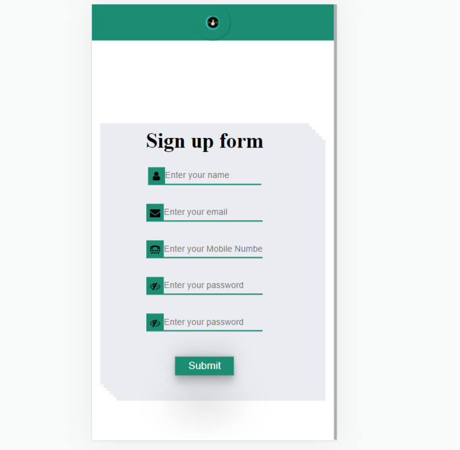

# Form Validation

## HTML

- Create HTML ,CSS and JS File
- Add the strcture in HTML 
-Create a simple sign up form with four input fields: username, email, Phone Number,password,confirm password
- Create h1 icon using font-awsome, button
---
## CSS 
---
- Create CSS file 
- Add the height and witdth to body 100vw and 100vh 
- Add the background color to the div 
- Diveded in two parts used `flex-grow`
- for form lookes beautiful I add the box-shadow 
- I used Position also in this
---
## JS
---
- Create Js file 
- Create `document.getElementById('give id name')` using this we target that particul element and store in varaibles 

- Add the addEventListener when you click the sign up without filling anything or incorrect data, the form will show an error message.To validate the username, email, Phone Number,password,confirm password I used RegEx.

-----
>Here is Image for Desktop 

----

>Here is Image for Mobile 

---
## it is responsive for all the device
